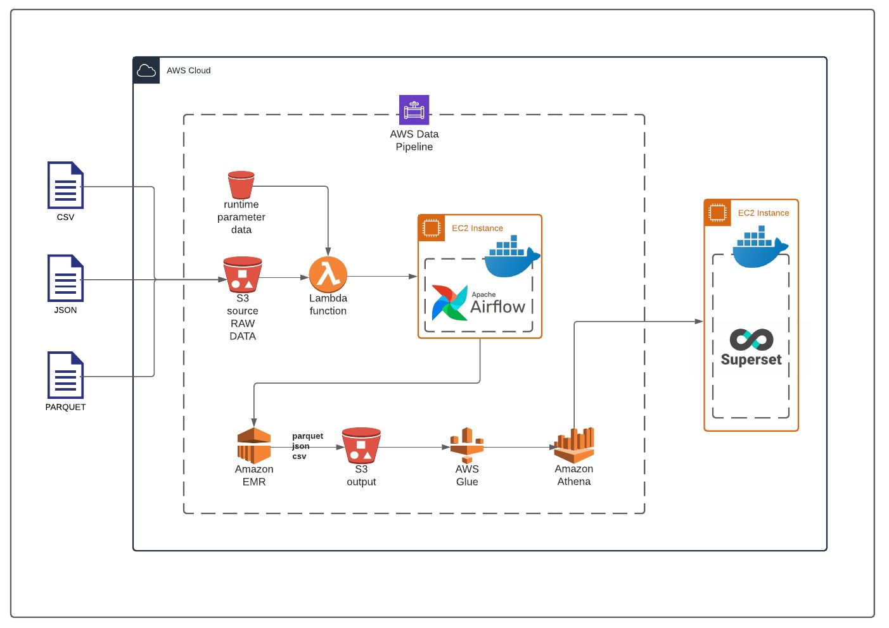

# aws-data-pipeline
This is a demonstration of an end-to-end data engineering pipeline implemented in AWS
Author: Albert Ngan
With help from: Edwin, Shaohua, Ziyang, Zheng, Bhargavi

## Introduction
This project demonstrates an end-to-end data pipeline implemented exclusively using AWS infrastructure. All steps from initial raw data feed to final visualization are included. 

## Architecture

## Pipeline Flow
1.  Raw data file: is directly uploaded to the designated Amazon s3 ‘source’ bucket
    This data file type may be csv, json, or parquet
    Required runtime parameters: are extracted from a json file 
    They include:
    -- input_file_type
    -- output_file_type
    -- name
    -- partition_column
    -- output_path

2.  Upload of the raw data file will trigger the lambda function which will: 
    Identify the (just uploaded) file details 
    Read the runtime parameters required later for spark 
    Call the Airflow API endpoint to run the Airflow DAG
    
3.  Airflow (running on AWS EC2 instance) will take over to orchestrate further tasks

4.  Airflow will run the Spark job on Amazon EMR Cluster

5.  EMR will output the partition data into the designated s3 output path

6.  Glue will run a crawler on the output data to infer the schema

7.  Athena will be used to perform SQL queries on the data and provide the interface to connect to Superset in the next step

8.  Apache Superset can create provide dashboard visualizations for futher interpretation and consumption

## Superset setup on Docker
Instantiate a T2.medium AWS EC2 instance
Install and start Docker
Use the Superset image here: 'docker pull edwinguo123/superset'
This image of Superset has the Athena plugin baked in to make connection quick and easy

## Airflow setup on Docker

## Important notes
* Airflow and Superset should be run on T2.medium EC2 instances, at minimum
* After an EC2 instance is stopped and then restarted, it will be assigned a new external IP address. This IP address must be updated  wherever it is used
* After an EMR Cluster is terminated and re-cloned at a later time, it will be assigned a new Cluster ID. This Cluster ID must be updated in the code wherever it is used

## Future Improvements
* Deployment on EKS
* Implement Spark engine in Scala
* Include additional configuration-driven parameters for spark engine
* Ability to handle additional file types
* Customizing the Glue-created tablename
* Using password stores/vaults for improved security
* Additional error-handling

