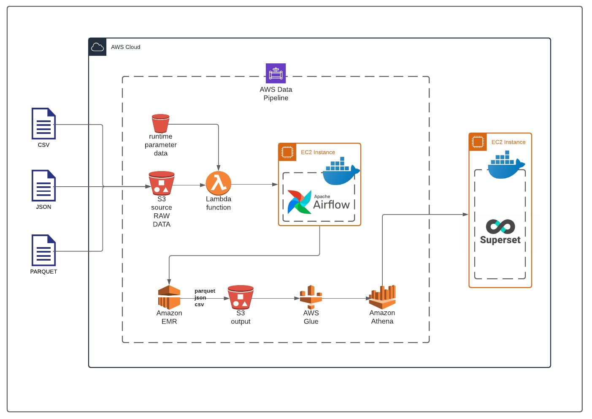

# aws-data-pipeline
 end to end data engineering pipeline in AWS
AWS end-to-end data pipeline: from file to fancy dashboard and everything in-between
Author: Albert Ngan
With help from: Edwin, Shaohua, Ziyang, Zheng, Bhargavi

## Introduction
This project demonstrates an end-to-end data pipeline implemented, exclusively using AWS infrastructure. All steps from initial raw data feed to final visualization are included. 
They include:
Data file ingestion

## Architecture

## Pipeline Flow
1.  Raw data file: is directly uploaded to the designated Amazon s3 ‘source’ bucket
    This data file type may be csv, json, or parquet
    Required runtime parameters: are extracted from a json file 
    They include:
    -- input_file_type
    -- output_file_type
    -- name
    -- partition_column
    -- output_path

2.  Upload of the raw data file will trigger the lambda function which will: 
    Identify the (just uploaded) file details 
    Read the runtime parameters required later for spark 
    Call the Airflow API endpoint to run the Airflow DAG
3.  Airflow (running on a AWS EC2 instance) will take over to orchestrate further tasks
4.  Airflow will spark-submit the job to to Amazon EMR
5.  EMR will output the partition data into the designated s3 output path

6.  Glue will run a crawler on the output data to infer the schema
7.  Athena will be used to perform SQL queries on the data and provide the interface to connect to Superset in the next step

8.  Superset will provide dashboard visualizations 

## How to use this project

## Future Improvements when time permits
* Deployment using k8s
* Include additional configuration-driven parameters for spark engine
* Customizing the Glue-created tablename
* Using password stores/vaults for improved security

